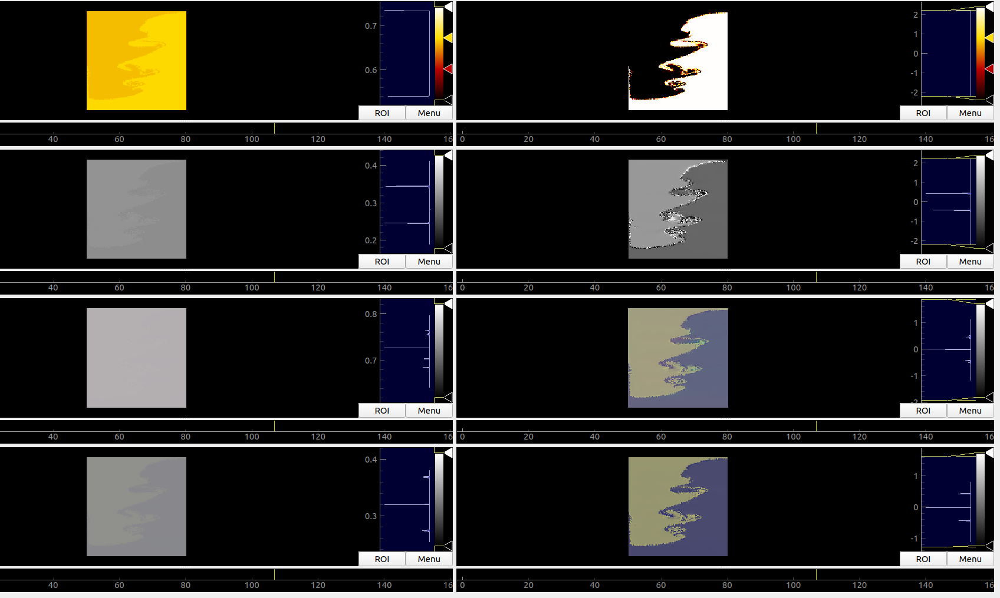

# Simulation-Fluid-Flow
Experiment into the feasibility of using machine learning to speed up Fluid Flow simulations for Aerospace design & testing. Current stage was simply to get the model to overfit a simple lock-exchange simulation. 

Project was based on [this paper](https://arxiv.org/pdf/1905.11075.pdf) and surrounding research. 

Project is so far inconclusive, but was abandoned after a bug fix revealed the accuracy to be much lower than previously thought. 
